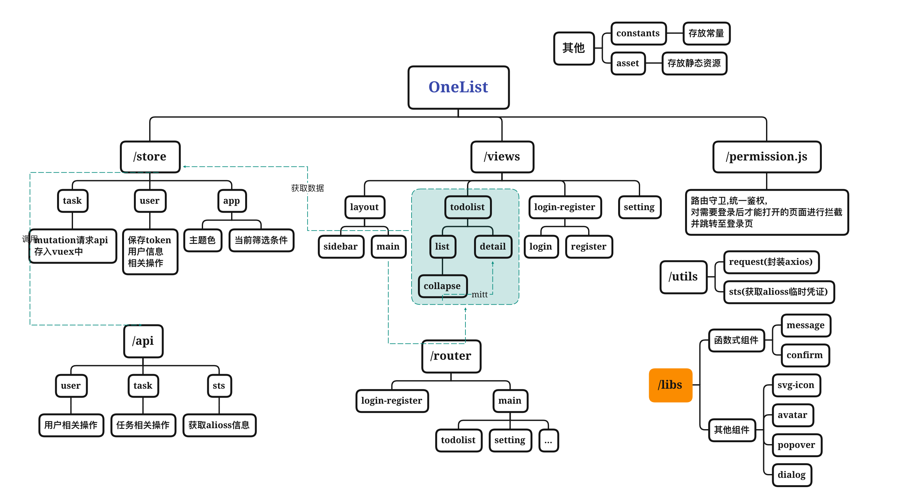

# OneList

OneList(一个清单) Web端仓库

> uniapp端仓库请移步 https://github.com/Xguihur/smallButPretty

项目开发团队：**2022 阿里巴巴终端练习生计划小而美项目组**

  

##  项目描述

- 一个基于 Vue3+Vite+tailwindcss的 " **简洁清单项目** "，帮助您合理安排一天中的任务安排。
- 一个帮你高效完成任务和规划时间的应用，是一款拥有跨设备云同步、清单管理、清晰分类的应用，你可以在Web、Android、微信小程序端使用它


## 示例

你可以点击下方的链接在线体验：

[🚀🚀🚀](https://gitee.com/link?target=http%3A%2F%2Fdatav.avuejs.com)[一个清单演示地址]:http://152.136.30.105:8090/

##   预览

> **登录/注册**
>
> 
>
> 
>
> **用户头像鼠标悬浮菜单**
>
> 
>
> **更换头像**
>
> 
>
> 
>
> **新建任务**
>
> 
>
> **任务详情**
>
> 
>
> **修改任务内容**
>
> 
>
> **任务右键菜单**
>
> 
>
> 
>
> **设置页面**
>
> 


## 技术细节

### 技术栈

- vite
- vue3
- vuex
- tailwindcss

### 亮点

- esLint + prettier + editorconfig + husky + commitizen 实现代码和提交规范
- 封装常用组件,例如dialog、avatar、button、popover、svg-icon等等
  - 函数式调用组件:message、confirm
- 封装axios,实现中断请求和前端缓存功能

## 已完成功能

- 账号注册/登录
- 修改用户名/密码
- 新建任务
- 任务右键菜单 修改任务优先级/时间/删除
- 任务详情页面修改项目标题/内容
- 任务优先级分类显示
- 根据时间和完成情况筛选任务
- 使用ali-oss 前端上传头像

## 待完成功能

- 日程页面
- 统计页面
- 回收站
- 打卡

###  模块说明



```
|-- OneList
    |-- src
        |-- App.vue
        |-- main.js 入口
        |-- permission.js 权限管理
        |-- api 后台接口
        |-- assets 静态资源
        |-- constants 常量
        |-- libs 封装的常用组件
        |-- router 路由
        |-- store vuex
        |-- utils	
        |-- views 页面
            |-- calendar
            |-- clock
            |-- layout 布局
            |-- login-register
            |-- setting
            |-- statistic
            |-- todolist
```

##  安装

```
# 安装依赖
npm install

# 运行
npm run dev

# 发布
npm run build
```

